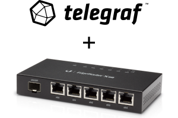
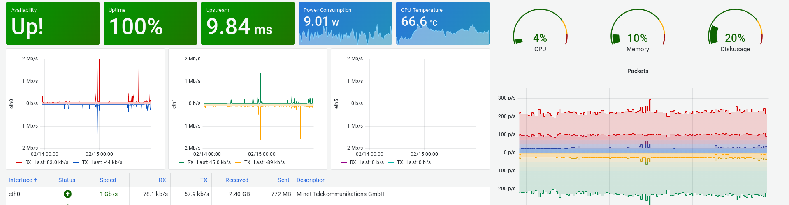

<p align="center">
  
</p>

# telegraf-edgeos

[](https://github.com/x70b1/telegraf-edgeos/actions)
[](https://github.com/x70b1/telegraf-edgeos/graphs/contributors)
[](https://github.com/x70b1/telegraf-edgeos/blob/master/LICENSE)
[](https://github.com/x70b1/telegraf-edgeos/releases)

A lightweight [Telegraf](https://github.com/influxdata/telegraf) distribution customized for Ubiquiti's EdgeOS.


## What is so cool here?

This Telegraf is crosscompiled for `mips` and `mipsel`.
To reduce the size only essential and basic networking related internal plugins are part of the packaged binary.
Check [inputs](https://github.com/x70b1/telegraf-edgeos/blob/master/patches/plugins/inputs/all/all.go) and [outputs](https://github.com/x70b1/telegraf-edgeos/blob/master/patches/plugins/outputs/all/all.go) to figure out which internal plugins are included.
The result is a ~ 18 mb binary file instead of ~ 130 mb for a full featured Telegraf.
So it should fit on every EdgeRouter.


## edgeos.sh

To collect metrics that are availiable on EdgeOS but not collected via an internal module the package contains an additional plugin.
You find it at `/usr/lib/telegraf/edgeos.sh`.
It works with different parameters:

**--firmware** checks Ubnt's servers for EdgeOS updates and returns the result

**--interfaces** returns more details about a network interface like description, up/down-status and negotiated speed

**--power** prints power stats, like `show hardware power`

**--temperature** prints temperature stats, like `show hardware temperature`


Example:

```
edgeos_firmware running="v2.0.9-hotfix.2",availiable="v2.0.9-hotfix.2",upgrade=0,model="EdgeRouter 12",serial="ABC123456"

...

edgeos_interface,interface=eth4,type=ethernet alias="Server A",state=0,speed=1000
edgeos_interface,interface=eth2,type=ethernet alias="Server B",state=1,speed=10
edgeos_interface,interface=eth0,type=ethernet alias="Provider XYZ",state=0,speed=1000

...

edgeos_power voltage=23.41
edgeos_power current=0.37
edgeos_power consumption=8.85
edgeos_temperature,sensor=CPU temperature=66.75
edgeos_temperature,sensor=Board\ 1 temperature=58.25
edgeos_temperature,sensor=Board\ 2 temperature=49.75
edgeos_temperature,sensor=PHY\ 1 temperature=68.50
edgeos_temperature,sensor=PHY\ 2 temperature=57.50
```


## Supported Hardware

|                       | Package               | Internal Plugins      | firmware              | interfaces            | power                 | temperature           |
| --------------------- | --------------------- | :----:                | :----:                | :----:                | :----:                | :----:                |
| `ER-X`                | mipsel                | :heavy_check_mark:    | :heavy_check_mark:    | :heavy_check_mark:    | :x:                   | :x:                   |
| `ER-X-SFP`            | mipsel                | :grey_question:       | :grey_question:       | :grey_question:       | :grey_question:       | :grey_question:       |
| `ER-4`                | mips                  | :grey_question:       | :grey_question:       | :grey_question:       | :grey_question:       | :grey_question:       |
| `ER-6P`               | mips                  | :heavy_check_mark:    | :heavy_check_mark:    | :heavy_check_mark:    | :heavy_check_mark:    | :x:                   |
| `ER‑8`                | mips                  | :grey_question:       | :grey_question:       | :grey_question:       | :grey_question:       | :grey_question:       |
| `ER-8-XG`             | mips                  | :grey_question:       | :grey_question:       | :grey_question:       | :grey_question:       | :grey_question:       |
| `ER-10X`              | mipsel                | :grey_question:       | :grey_question:       | :grey_question:       | :grey_question:       | :grey_question:       |
| `ER-12`               | mips                  | :heavy_check_mark:    | :heavy_check_mark:    | :heavy_check_mark:    | :heavy_check_mark:    | :heavy_check_mark:    |
| `ER-12P`              | mips                  | :grey_question:       | :grey_question:       | :grey_question:       | :grey_question:       | :grey_question:       |
| `ERLite-3`             | mipsel                | :heavy_check_mark:    | :heavy_check_mark:    | :heavy_check_mark:    | :x:                   | :x:                   |
| `ERPoe‑5`             | mips                  | :grey_question:       | :grey_question:       | :grey_question:       | :grey_question:       | :grey_question:       |
| `ERPro-8`             | mips                  | :grey_question:       | :grey_question:       | :grey_question:       | :grey_question:       | :grey_question:       |
| `EP-R6`               | mipsel                | :grey_question:       | :grey_question:       | :grey_question:       | :grey_question:       | :grey_question:       |
| `EP-R8`               | mips                  | :grey_question:       | :grey_question:       | :grey_question:       | :grey_question:       | :grey_question:       |


:heavy_check_mark: = Works for me!

:x: = No hardware support for this feature :(

:grey_question: = Unknown

Your device is not listed with a green check mark? Please open an issue if you have tested Telegraf on an EdgeRouter and share your findings.


## Setup

Install the prebuild package:

```sh
curl -L -o telegraf.deb https://github.com/x70b1/telegraf-edgeos/releases/download/{RELEASE}/telegraf_{RELEASE}_{ARCH}.deb
dpkg -i telegraf.deb
```

You can upgrade Telegraf with the same commands.

As you already know from InfluxData's distribution of Telegraf, the configuration is located at `/etc/telegraf/telegraf.conf` and `/etc/telegraf/telegraf.d`.
The [sample config](https://github.com/x70b1/telegraf-edgeos/blob/master/configs/telegraf.conf) is pre-installed. This needs to be modified for your own use case.


## Dashboard

[](#)

I added a sample Grafana dashboard.

It comes without warranty.
You will have to customize it.

* [grafana_edgerouter.json](grafana/grafana_edgerouter.json)
* [grafana_edgerouter_fullscreen.png](grafana/grafana_edgerouter_fullscreen.png)
